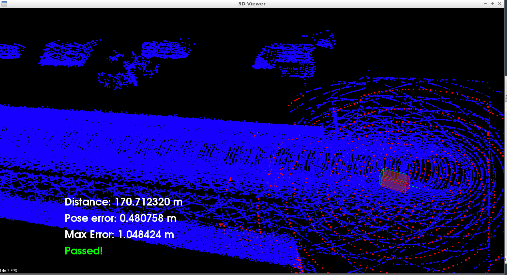

# ScanMatchingLocalization

## Project Introduction
In this final project, a car is localized in simulation. The simulation car is equipped with a lidar, provided by the simulator at regular intervals are lidar scans.

## Results
ICP is used to match lidar scans with the map to best fit the estimation pose with the map. The objective is to localize a car driving in simulation for at least 170m with the pose error never goes above 1.2m. The following figure shows the result

